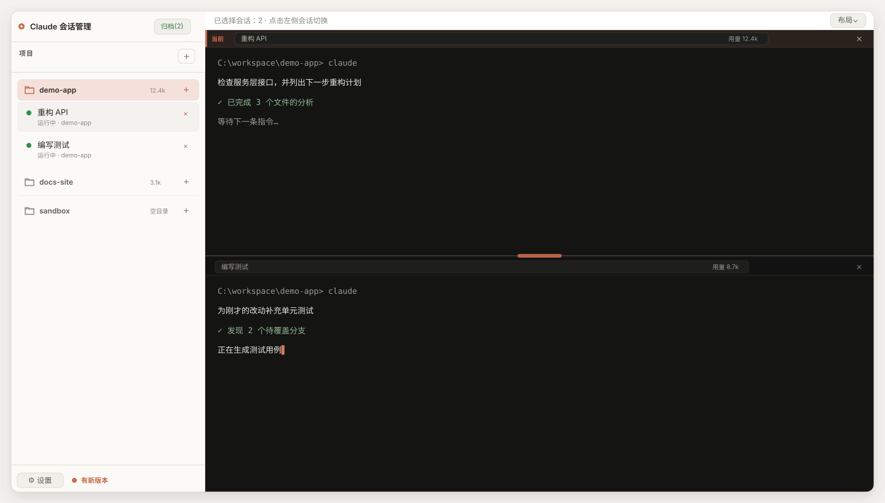

# Claude 会话管理器

Windows 原生 Claude 会话管理器：Go/Wails v2、xterm.js 与 ConPTY 组成右侧多会话终端，左侧列表负责分组、折叠、恢复和归档；切换和关闭都在左侧会话列表完成。



> 图片采用应用默认的日间 UI 和「Claude 暖黑」终端主题；其中的项目名、路径和会话内容均为演示数据，不对应任何真实项目。

## 功能

- 多会话 ConPTY 终端：会话后台保持运行，切换互不关闭；支持恢复、新建、重命名、归档和关闭。
- 会话按工作目录分组；折叠、全局眼睛筛选、完成徽标、未读提示和完成动画保持独立。
- 顶部只保留一行「项目」和加号；保存的工作目录直接并入左侧会话列表，空目录也会显示，目录分组的 `+` 使用该目录创建新会话。
- 左下角「⚙ 设置」管理日间/夜间 UI 主题、8 套终端主题和底层 Shell（cmd / pwsh）。
- 终端支持单屏、上下/左右双屏、三分屏和四分屏；分屏控制线可拖动调整比例，清空窗格时会按布局自动收缩。
- 设置中的「更新」只检查 GitHub Releases 的 `v*-wails` 正式版本；应用每天自动检查一次，也可手动检查、显示下载进度并自动替换重启。
- 本地状态包括 `favorites.json`、`open-sessions.json`、`settings.json` 和 `projects.json`，默认位于 exe 同目录。

## 快速使用

1. 从 [Releases](https://github.com/gp-alex-chen/claude-session-manager/releases/latest) 下载最新的 `claude-terminal.exe`，并确保 Windows 已安装 WebView2 Runtime。
2. 确认 `claude` CLI 已加入 `PATH`，然后双击运行 exe。
3. 点击左侧「项目」旁的 `+` 添加工作目录；点击目录分组的 `+`，即可在该目录下新建会话。已有会话会按工作目录自动分组。
4. 点击终端状态栏的「布局」选择单屏、双屏、三分屏或四分屏；分屏后的控制线可以左右或上下拖动。
5. 右键目录分组可收藏项目或直接打开文件夹；左下角「⚙ 设置」可调整外观、终端主题、Shell 和更新选项。

## 界面说明

### 项目和会话列表

- 「眼睛」按钮只影响已经折叠的目录：开启时保留其中正在运行的会话，关闭时折叠目录中的会话全部隐藏；展开目录不受影响。
- 文件夹图标表示目录分组，展开/折叠会切换打开和关闭的文件夹图标；图标变为陶土橙表示该目录已收藏并置顶。
- 目录分组右侧的 `+` 会在该目录下新建会话；右键目录分组可以收藏/取消收藏，或直接打开 Windows 文件夹。

### 会话状态图例

| 图标或表现 | 含义 |
| --- | --- |
| 绿色动态波形 `▁▂▃▅▇` | 正在执行任务。波形会持续变化，表示 agent 正在工作。 |
| 橙色 `⚠` | 等待权限批准，需要回到该会话处理授权。 |
| 橙色 `●` | 后台待命或排队，当前没有正在执行的任务。 |
| 绿色 `◉` | 交互会话已打开，正在等待输入。 |
| 灰色 `●` | 未运行，会话当前没有对应的终端进程。 |
| `─` 短暂出现，随后变为强调色 `●` | 任务刚刚完成；如果当时没有查看该会话，圆点会保留为“已完成 · 未读”，点击会话即可查看并清除未读提示。 |

### 终端和分屏

- 状态栏的「布局」可以切换单屏、上下/左右双屏、三分屏和四分屏。
- 分屏中间的控制线可以拖动，调整左右宽度或上下高度；当前获得焦点的窗格会显示「当前」标记。
- 窗格下拉框可以把一个正在运行的会话放入该窗格；窗格右侧的 `×` 只清空窗格并按布局收缩，不会关闭会话进程。
- 顶部「归档(n)」用于查看和恢复已归档的会话；左下角「有新版本」提示表示发现了可用更新。

## 亮点

- 多会话并行：会话在后台保持运行，切换项目不会关闭正在执行的任务。
- 灵活分屏：按工作流选择布局，拖动控制线分配空间，适合同时观察多个 Claude 会话。
- 项目管理轻量直接：目录可收藏并置顶、快速打开文件夹，空目录也能提前准备工作区。
- 状态与体验完整：支持会话恢复、归档、主题切换、Shell 选择和新版本提示。

## 前置条件

- Windows 10/11 与 WebView2 Runtime。
- Go 1.25、Node.js 22/npm。
- Claude CLI 在 `PATH` 中；真实 agents/ConPTY 集成测试也需要它。
- 普通构建不要求安装 Wails CLI：仓库提交了 `frontend/wailsjs` 的兼容 wrapper，后端可直接用 `go build`。

## 目录

```
main.go                         Wails composition root：embed、启动、绑定
internal/app/                   Wails App 绑定与业务编排
internal/terminal/              ConPTY 生命周期、输入输出、token 管理
internal/state/                 favorites/open-sessions/settings 原子状态存储
internal/session/               ~/.claude/projects 会话解析
internal/agent/                 claude agents watcher 与调试日志
internal/notify/                Windows 提示音
internal/updater/               GitHub 更新检查、下载、自替换
frontend/src/app/                应用 bootstrap 与统一生命周期
frontend/src/terminal/           终端 controller
frontend/src/agents/             agent 状态 controller
frontend/src/sessions/           会话 controller、配对 helper、列表 view
frontend/src/settings/           设置 controller
frontend/src/updates/            更新 controller
frontend/src/state/              前端共享 state
frontend/src/styles/             themes/base/sidebar/menus/terminal 分层 CSS
frontend/src/themes/             终端主题 catalog
frontend/src/api/backend.js     前端唯一 Wails wrapper 边界
frontend/wailsjs/                提交到仓库的 Wails 兼容绑定 wrapper
frontend/test/                   Node 内置测试（纯逻辑与 fake DOM）
assets/                          源资源；syso 留在 main 包目录
docs/maintenance.md              维护、测试与扩展手册
```

## 可复现开发命令

```powershell
cd frontend
npm ci
npm test
npm run build
cd ..
go test ./...
go vet ./...
go build -tags "webview2 production" `
  -ldflags "-s -w -H windowsgui -X github.com/gp-alex-chen/claude-session-manager/internal/app.Version=v0.2-wails" `
  -o claude-terminal.exe .
```

`-H windowsgui` 生成 GUI 子系统版本；调试时可去掉它。普通 Go 单元测试使用 fake、临时目录和依赖注入，不需要本机 Claude 会话。真实环境测试明确使用 integration tag：

```powershell
go test -tags integration ./internal/terminal
go test -tags integration ./internal/agent
```

这两组 Windows 集成测试分别依赖真实 ConPTY 和 `claude agents --json`。

## 数据流与状态文件

```
ConPTY 输出 -> base64 -> term:data(token, b64) -> 对应 xterm
键盘输入 -> UTF-8/base64 -> TermWrite -> ConPTY
窗口 resize -> FitAddon -> TermResize -> ConPTY
agent watcher（约 1~2s） -> agents:update -> 徽标/未读/完成提示
前端每 30s GetAgents 兜底 -> 使用后端 watcher 缓存
```

- `favorites.json` 保存会话 ID、显示别名和隐藏 ID。
- `open-sessions.json` 保存关闭应用时仍运行的会话 ID。
- `settings.json` 保存 `cmd`/`pwsh` 选择。
- `projects.json` 保存项目工作目录数组和收藏目录数组，格式为 `{"dirs":["..."],"favorites":["..."]}`；`favorites` 可省略以兼容旧文件。项目只是用户选择并保存的目录字符串，不包含额外的项目数据。
- 写入使用同一 Store 锁、项目文件的跨进程锁和临时文件替换；读取损坏或包含空白目录项时返回安全默认并记录诊断。

项目目录由 Wails App 提供 `ListProjects`、`ChooseProjectDir`、`AddProject`、`OpenFolder`、`ListProjectFavorites`、`SetProjectFavorite` 和兼容性的 `DeleteProject`。目录选择器取消时不保存；添加目录会按规范化完整路径去重，重复添加幂等成功。删除只移除 `projects.json` 中的配置，不删除真实目录、历史会话或终端，并同步移除该目录的收藏；当前界面不提供删除按钮。重启时保存目录和收藏会从 `projects.json` 恢复并合并到会话列表，即使目录当前没有会话或后来已不存在也继续显示；右键任意目录分组都可添加/取消收藏，收藏目录按最近收藏顺序置顶并高亮文件夹图标，目录分组 `+` 复用 `StartNew(dir)`，右键目录分组可直接打开 Windows 文件资源管理器。会话恢复仍以会话自身保存的 `dir` 为准。

项目相关的确定性覆盖包括：项目和收藏持久化往返、收藏最新置顶、损坏或缺失文件的安全读取、规范化重复目录、单行项目区域、空目录分组、添加/取消/后端删除边界、目录分组 `+` 的 `StartNew(dir)` 转发、项目和会话自动生成目录的右键收藏及打开文件夹、失效目录启动失败不产生 pending 会话，以及重启恢复时使用会话自身目录。绑定集合和参数转发由 frontend binding test 校验。

可单独运行项目相关检查：

```powershell
cd frontend
node --test test/app-bootstrap.test.js test/backend-bindings.test.js test/projects-controller.test.js test/session-controller.test.js
node --check src/app/bootstrap.js
node --check src/sessions/controller.js
node --check src/sessions/view.js
cd ..
go test ./internal/state ./internal/app
git diff --check
```

## 发布与更新

CI 对 `v*-wails` tag 构建 `claude-terminal.exe` 并发布 GitHub Release；`-pre`/`-rc` tag 标为预发布。手动触发可构建 artifact，但不会创建 release。应用更新只选择 `v*-wails` 正式版本，版本通过 `internal/app.Version` 注入。

```bash
git tag v0.2-wails
git push origin v0.2-wails
```

更新是粗粒度 PE 头校验，不提供签名/哈希验证；应用目录必须可写。更新前会结束 ConPTY，会话清单先持久化，重启后恢复。

## 已知限制

- ConPTY/conhost 可能让 Claude 的 `/theme auto` 误判亮色背景；需要在 Claude 内手动 `/theme light`。
- `Ctrl+V`、`Ctrl+Shift+V`、`Shift+Insert` 粘贴；`Ctrl+Enter` 发送 LF。未读状态只保存在内存中。
- pwsh 需要 PowerShell 7 的 `pwsh` 在 PATH；不可用时后端会回退 cmd 并记录诊断。

更多架构约定、并发边界、测试分层和扩展步骤见 [`docs/maintenance.md`](docs/maintenance.md)。
